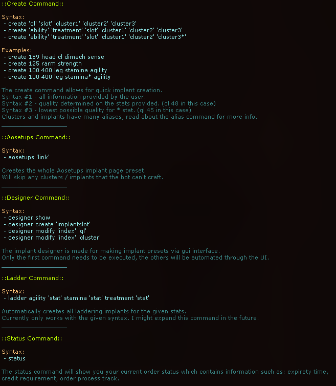

To be used with AOSharp Clientless. This bot was made to fully automate implant making and buying. It features:

- AOsetup links for full autonomous buying / tradeskilling
- Alternatively use the designer command
- Quickly make implants with one liner commands (example: create 159 head cl perception dimach)
- Laddering command to automatically make stamina / agility / treatment implants

Help command:

Preview video:

[Watch the preview video here](https://streamable.com/63ilsx)